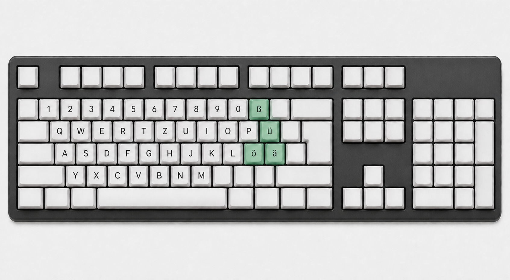

# 美式键盘德语字符键（ÄÖÜß）

[English](README.md) · [简体中文](README.zh-CN.md) · [繁體中文](README.zh-TW.md) · [Deutsch](README.de.md)

一个轻量桌面工具，让你直接在美式 ANSI 键盘上输入德语字符，支持 Windows 和 macOS。



## 功能

- 将四个美式键盘物理按键映射为德语字符。
- 使用 `Shift` 和 `Caps Lock` 输入大写和小写字符。
- 与 `Ctrl`、`Alt`、`Command`、`Option` 或 `Windows` 修饰键组合时透传原始按键。
- 使用可配置的全局快捷键切换映射。
- 可选择登录时自动启动。
- 支持浅色、夜间和跟随系统主题。
- 支持简体中文、繁體中文、English 和 Deutsch 界面。
- 提供独立帮助窗口、键盘示意图和映射说明。
- 在操作系统要求时显示辅助功能权限提示。

## 按键映射

开启映射后，以下美式键盘物理按键会输出德语字符：

```text
[  -> ü / Ü
'  -> ä / Ä
;  -> ö / Ö
-  -> ß / ẞ
```

按住 `Shift` 可输入大写字符。Caps Lock 会改变默认大小写，同时按住 `Shift` 和 Caps Lock 时会反转大小写。

与 `Ctrl`、`Alt`、`Command`、`Option` 或 `Windows` 组合使用时，按键保持不变。程序处理物理按键事件，不读取输入法内部状态，因此其他输入法开启时也会执行映射。

## 使用方法

1. 安装并启动应用。
2. 在主界面开启德语字符映射。
3. 在支持输入的文本框中按下上述按键。
4. 打开快捷键编辑器，录制或恢复全局切换快捷键。
5. 使用语言按钮切换界面语言。
6. 使用外观按钮选择浅色、夜间或跟随系统。
7. 打开帮助页查看键盘图和完整映射说明。

macOS 用户需要先在 **系统设置 > 隐私与安全性 > 辅助功能** 中允许本应用，然后才能开启映射。Windows 不需要额外的辅助功能权限。

## 平台支持

| 平台 | 支持情况 | 说明 |
| --- | --- | --- |
| Windows x64 | 完整支持映射 | 使用低级键盘钩子，不需要额外应用权限。 |
| macOS Apple Silicon | 完整支持映射 | 需要辅助功能权限，Release 目标为 `aarch64-apple-darwin`。 |

## 开发

需要 Node.js、npm、Rust，以及 Tauri 2 要求的平台开发环境。

```bash
npm install
npm run tauri dev
```

单独构建前端：

```bash
npm run build
```

运行 Rust 测试和格式检查：

```bash
cargo test --manifest-path src-tauri/Cargo.toml
npm run format:check
```

完整检查会执行格式检查、测试、Clippy 和前端构建：

```bash
npm run check
```

## Release 构建

### Windows

构建 Windows x64 NSIS 安装包：

```bash
npm run build:windows-release
```

也可以在项目根目录运行 `build-windows-release.cmd`。安装包输出到 `src-tauri/target/release/bundle/nsis/`，该命令只生成 NSIS，不生成 MSI。

### macOS

请在 Apple Silicon Mac 上构建 Apple Silicon DMG：

```bash
chmod +x build-macos-release.sh
./build-macos-release.sh
```

等效 npm 命令是 `npm run build:macos-release`。DMG 输出到 `src-tauri/target/aarch64-apple-darwin/release/bundle/dmg/`。

未签名或未公证的 macOS 构建仅用于测试和内部分发。公开发布需要 Apple Developer 签名和公证。

## 限制

- 密码框、macOS Secure Input、远程桌面会话和部分高权限窗口可能限制键盘事件拦截。
- 程序映射物理按键，不检测或修改输入法内部状态。
- macOS 必须先获得辅助功能权限才能启动映射。

## 技术栈

桌面外壳和原生键盘集成使用 Tauri 2 与 Rust。界面使用 Vue 3、Vite、Tailwind CSS 4、Reka UI、Lucide 图标和 motion-v。Windows 与 macOS 键盘后端位于 `src-tauri/src/keyboard/`。

## License

当前仓库尚未声明许可证。在添加许可证文件前，所有权利归版权持有人所有。
